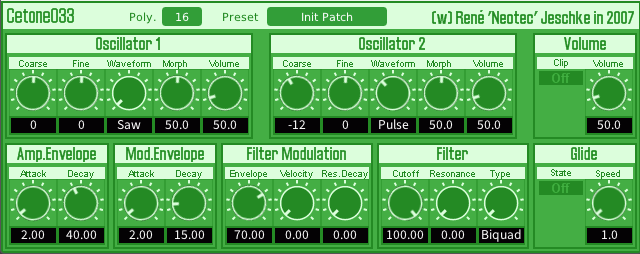

# Cetone033

Cetone033 is a analogue-style bassline synthesizer, originally developed by Neotec Software. Though it has been designed for basslines, it's also a chiptune style synthesizer. **Originally written by [René Jeschke](https://github.com/rjeschke).**

Sadly, Cetone Synth series had been discontinued for more than 12 years (since 2012), and it only supported VST 2.4. Original project is [here](https://github.com/rjeschke/cetonesynths).

**But now, I (AnClark) brings it to life again, by re-implementing those plugins to [DISTRHO Plugin Framework](https://distrho.github.io/DPF/).** It now runs well on most modern platforms, with advanced features and multi-format support.

The original Cetone033 was a monophonic synthesizer. Now I implemented **polyphony support**, and this version supports up to 16 voices.



## Features

- **16-voice polyphony synthesizer**
  - Configurable polyphony (from monopoly to 16 voices)
- **2 oscillators with 3 chiptune-style waveforms**
  - Waveforms: Saw, Square (pulse), Triangle
- **Analog-modelled filter**
  - **Supported models**: Biquad, **Moog**
  - Switchable filter mode
  - Resonance support
- **Simple modulation on filter**
- Glide (portamento) support
- Simple "Attack-Decay" envelope
- **Cross-platform**
  - Supports: Windows, macOS, Linux
- **Multi-format**
  - Provides: VST 2.4, VST3, LV2, CLAP, Standalone ([JACK](https://jackaudio.org/) only)
- **Preset manager**
  - Save and load presets in JSON format
  - Preset manager menu with bank and program support

## How To Build

### 0. Prerequisites

You need to install GCC, CMake, GNU Make and Ninja on your platform. Ninja is highly recommended for its high performance.

### On Linux

```bash
# Ubuntu
sudo apt update
sudo apt install gcc cmake make ninja

# Arch Linux
sudo pacman -Syu
sudo pacman -S gcc cmake make ninja
```

### On Windows

**You need to install Msys2 to build Cetone Synth series.** Download and install it from <https://msys2.org>.

After installation, run **MSYS2 UCRT64 Shell** from desktop (or Start Menu), then execute these commands:

```bash
pacman -Syu
pacman -S mingw-w64-ucrt-x86_64-gcc mingw-w64-ucrt-x86_64-cmake mingw-w64-ucrt-x86_64-ninja
pacman -S make
```

You can also install Git in Msys2, if you need:

```bash
pacman -S git
```

**Every command below should be executed in MSYS2 UCRT64 Shell.**

### 1. Clone source tree

```bash
# Source tree has 1 submodule: DPF. So you need to add --recursive
git clone https://github.com/AnClark/Cetone033.git cetone033 --recursive

# If you forget --recursive, run this
cd cetone033
git submodule update --init --recursive
```

### 2. Build

Cetone series now use CMake as build system. **All platforms share the same commands**.

You can explicitly specify built type here. For best performance, `Release` build is recommended. Optionally you can also set build type to `Debug`.

```bash
cd cetone033
cmake -S . -B build -DCMAKE_BUILD_TYPE=Release -GNinja    # If you want to use Ninja
cmake -S . -B build -DCMAKE_BUILD_TYPE=Release            # If you are not using Ninja. On Msys2, CMake uses Ninja by default
cmake --build build
```

Built plug-ins reside in `build/bin`. Copy plugins to your DAW's search paths.

## Build Options

You can also specify some build options to enable or disable features (via `-D` flag in CMake). These options are listed below:

| Option | Description | Default |
| --- | --- | --- |
| `CETONE_ENABLE_POLYPHONY` | Enable polyphony support. If disabled, plugin will be monophonic, which is original Cetone033's behavior. | `ON` |
| `CETONE_ALLOW_VOLUME_BOOSTING` | Allow volume boosting when polyphony is enabled.<br>This enables output normalization as well, in order to prevent overflow. | `ON` |
| `CETONE_BUILD_JACK_STANDALONE` | Build standalone version with [JACK](https://jackaudio.org/) support. | `OFF` |

## Notices about Polyphony and Presets

- **Monopoly builds (`CETONE_ENABLE_POLYPHONY=OFF`) is NOT recommended**, and only for developement purpose (e.g. A/B test with original Cetone033). You can easily switch to monopoly mode on polyphonic builds by setting polyphony to 1 voice in plugin's UI.
- Only polyphony mode supports volume boosting.
- Presets in polyphony builds are not compatible with monopoly builds, and vice versa. You need to use different preset banks for different builds.

## License

- [René's original repo](https://github.com/rjeschke/cetonesynths) is provided 'as is' and license free for public use.
- This repository is licensed under GNU GPLv3.

## Credits

- [René Jeschke](https://github.com/rjeschke) - Original author
- [AnClark Liu](https://github.com/AnClark) - Maintainer of this repository. Re-implemented Cetone033 to DPF, and added new features.
